# Internship_Report

## Network Penetration Testing

### Submitted by:

Francis Dorsaa

# Table of Contents
1. [Summary](#summary)
2. [Testing_Methodogy](#TestingMethodogy)
3. [Host_Discovery](#HostDiscovery)
4. [Sevice_Discovery_and_Port_Scanning](#SeviceDiscoveryandPortScanning)
5. [vulnerabilities](#Vulnerabilities)
6. [Web-Based_Attack_Surfaces](#Web-BasedAttackSurfaces)

# Summary
An internal network penetration test was conducted on the network range 10.10.10.0/24 and the domain https://virtualinfosecafrica.com/ from September 12th, 2024 to September 14th, 2024. This report provides a snapshot of the network's security posture at that time and includes detailed findings from the test.

# Testing Methodology
The testing began with the use of the Network Mapper (NMAP) tool to identify live hosts and services within the specified IP range. The results from this scan were manually reviewed to identify any additional vulnerabilities or weaknesses. Web-based attack vectors were then explored to generate relevant payloads.

# Host Discovery
Host discovery involves identifying active devices on a network, which helps narrow the focus for further assessment or security testing. NMAP was used for this purpose with the command nmap -sn 10.10.10.0/24. The -sn option performs a "ping scan" to detect live hosts without conducting a full port scan. The scan covers all IP addresses from 10.10.10.1 to 10.10.10.254.

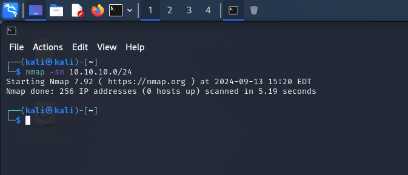

The below image is a description of how subdomain enumeration was performed using aiodnsbrute tool
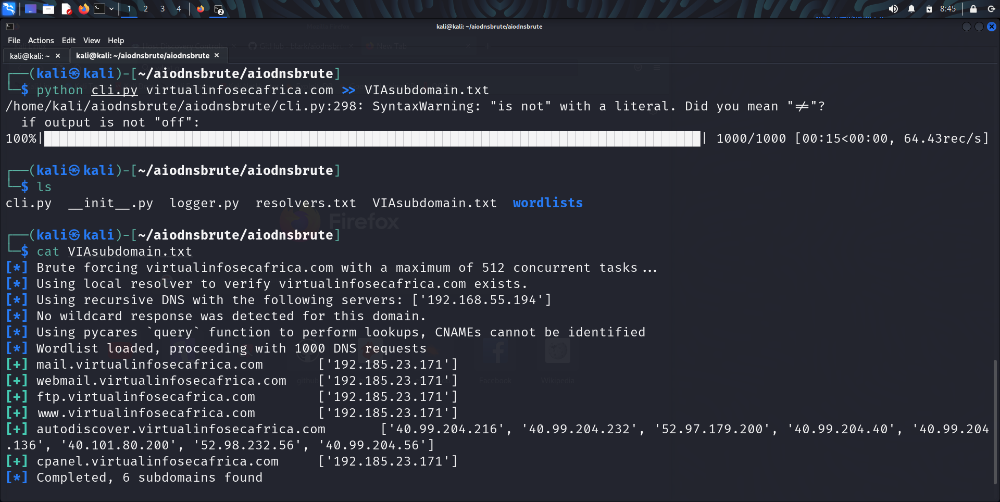

# Service Discovery and Port Scanning
### Service Discovery

Purpose: Identifies active services like web servers or databases.

Benefits:

- Configuration Management: Verifies and manages service configurations.
- Troubleshooting: Helps diagnose and resolve network issues.
- Security: Identifies exposed services and potential vulnerabilities.

### Port Scanning

Purpose: Detects open ports on devices, revealing available services.

Benefits:
- Network Mapping: Understands the network layout and services.
- Security Assessment: Identifies vulnerable open ports.
- Compliance: Ensures adherence to security policies by checking for unintended open ports.
- 
Combined Use

- Enhanced Security: Provides a comprehensive view of network security, helping identify vulnerabilities and ensure proper configuration.
- Efficient Management: Assists in maintaining a secure network environment by detecting issues early.
  
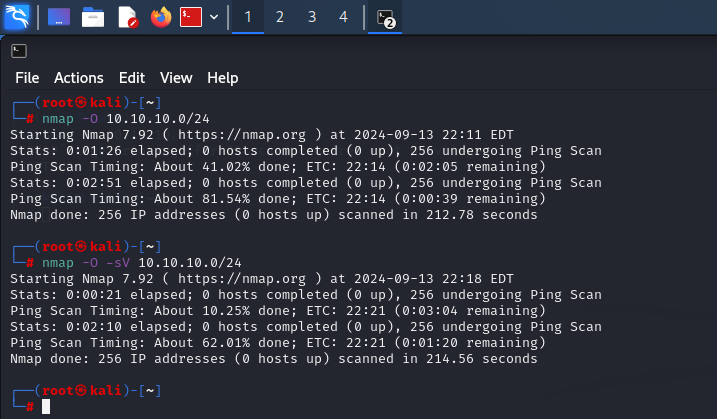

# Vulnerability Scanning
Vulnerability scanning is an automated process that identifies security weaknesses in systems, networks, or applications. It helps detect unpatched software, misconfigurations, and other exploitable vulnerabilities. The process involves discovering live hosts, scanning for known issues, analyzing results, and generating reports.

The image below shows how to create a custom wordlist using cewl and outlines the procedure for vulnerability scanning.

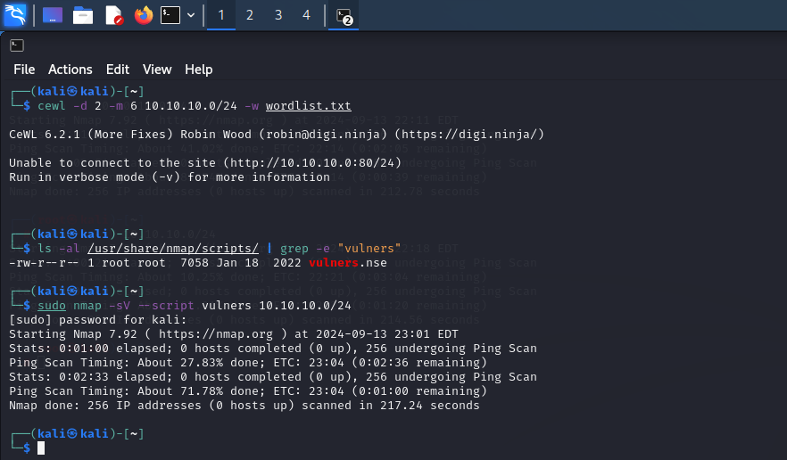

---

#### Summary of Findings
| Finding                                        | Severity |
|------------------------------------------------|----------|
| Unauthenticated Remote Code Execution (RCE) | Critical    |
| Denial of service (DoS)                          | Moderate     |
|UltraVNC DSM Plugin Local Privilege Escalation                   | High     |
| Apache Tomcat AJP File Read/Inclusion |Critical  |

#### Detailed Findings
#### Unauthenticated Remote Code Execution (RCE)

| *Current Rating:* | CVSS Score   |
|-------------------|--------------|
|Critical           |   9.8         |

Evidence: This vulnerability exploits an unauthenticated RCE flaw in Apache version 2.4.49 (CVE-2021-41773). If files outside the document root are not restricted by ‘require all denied’ and CGI is enabled, arbitrary commands can be executed. This issue was reintroduced in the Apache 2.4.50 fix (CVE-2021-42013).

Metasploit auxiliary module output

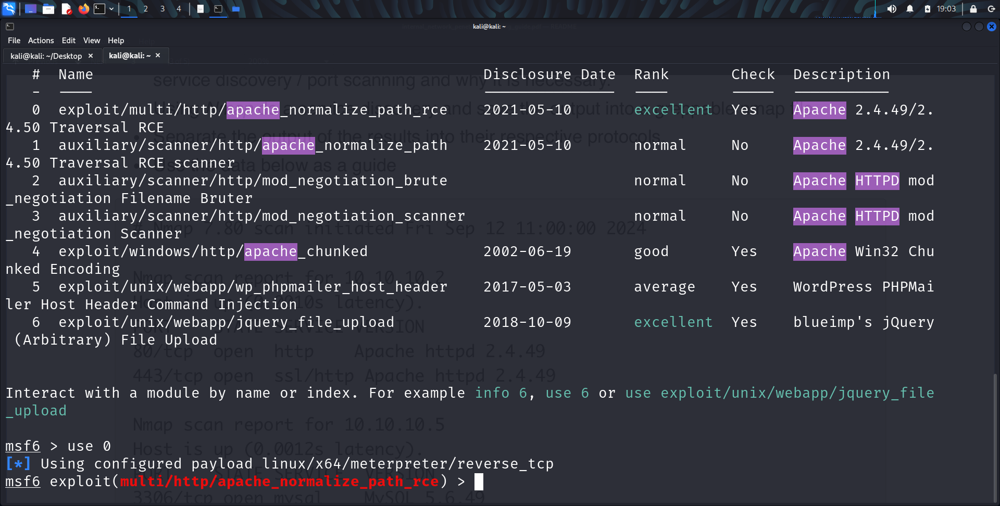

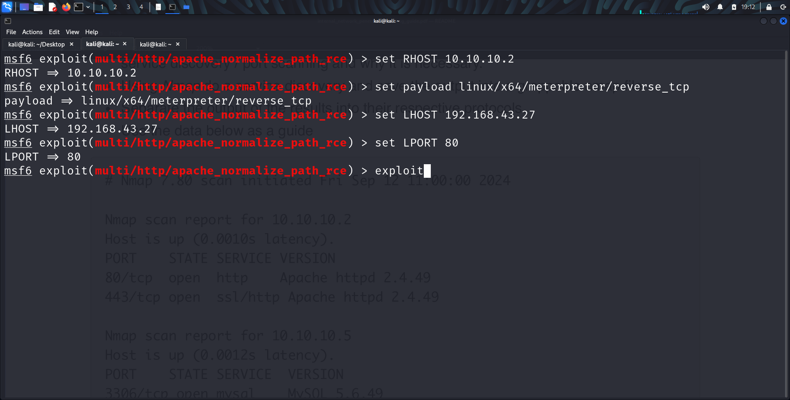

 #### Affected Resources are;
      '10.10.10.2, 10.10.10.30, 10.10.10.45, 10.10.10.55'

 #### Recommendations
      Update to a newer patched version of Apache HTTP Server.

---
### Denial of service (DoS)

| *Current Rating:* | CVSS Score   |
|-------------------|--------------|
|Medium          |   6.5         |

These are the vulnerabilities associated with the service version  `MySQL 5.6.49 ` with the port `3306`

These vulnerabilities affect MySQL version 5.6.49 on port 3306.

#### Evidence:

CVE-2020-14765: This flaw in the FTS component allows a low-privileged attacker with network access to cause a DoS by making the MySQL Server hang or crash. It has a CVSS 3.1 Base Score of 6.5, indicating medium severity with a focus on availability.

CVE-2020-14769: Found in the Optimizer component, this vulnerability also allows for potential DoS by causing the server to hang or crash. It has the same CVSS score of 6.5, reflecting medium severity and impact on availability.

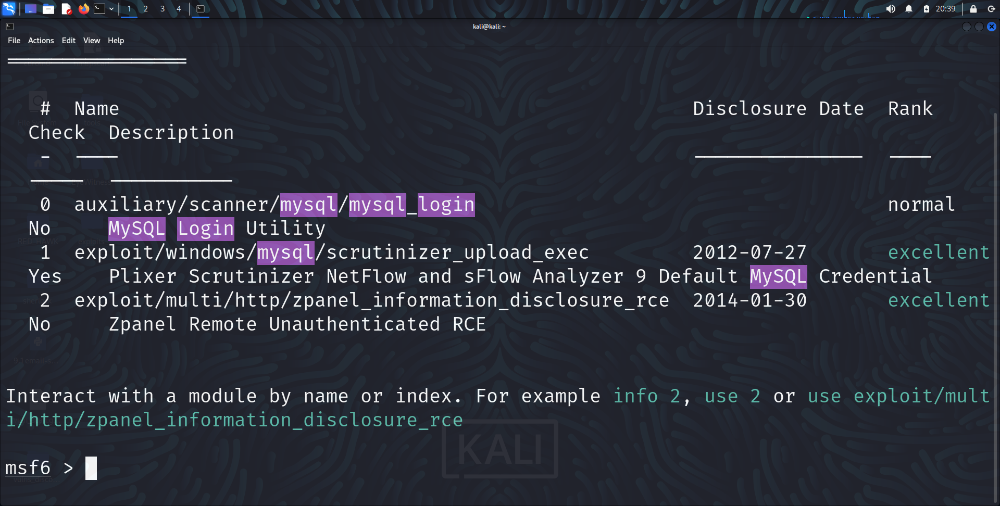

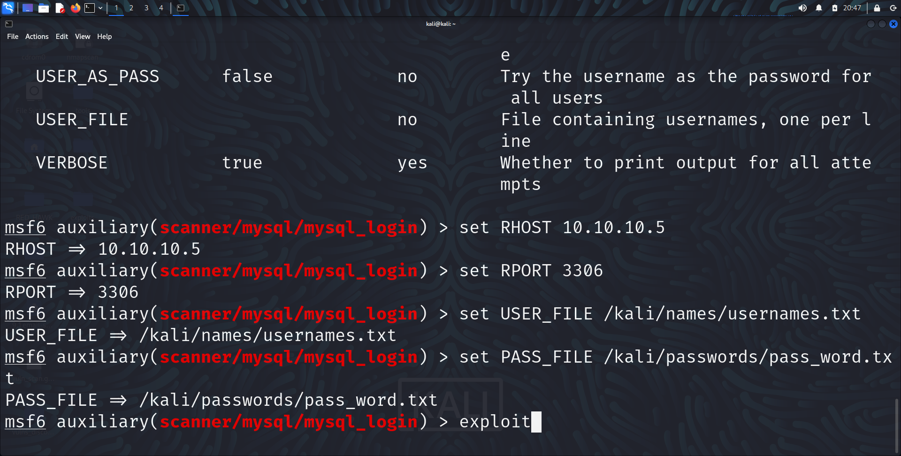

#### Affected Resources:
`10.10.10.5 , 10.10.10.40`

#### Recommendations:

- Rate Limiting: Implement to control the number of requests within a specific timeframe.
- Traffic Filtering and Shaping: Use firewalls and IPS to block malicious traffic and prioritize legitimate requests.
- Load Balancing: Distribute traffic across multiple servers to prevent overloading any single server.

---
### UltraVNC DSM Plugin Local Privilege Escalation Vulnerability
| *Current Rating:* | CVSS Score   |
|-------------------|--------------|
|  High           |     7.8      |

It was discovered that the service version for the affected resourses which is UltraVNC 1.2.1.7 is the old version which contain vulnerabilities which could be exploited.

UltraVNC 1.2.1.7 is an outdated version with known vulnerabilities.

#### Evidence:  

CVE-2022-24750 affects versions prior to 1.3.8.0 and allows local privilege escalation through the DSM plugin module. The vulnerability is fixed in version 1.3.8.1, which restricts plugin loading to the installed directory.

If upgrading is not possible, avoid running UltraVNC as a service and use a scheduled task with a low-privilege account to start WinVNC.exe. No workarounds are available if WinVNC must run as a service.

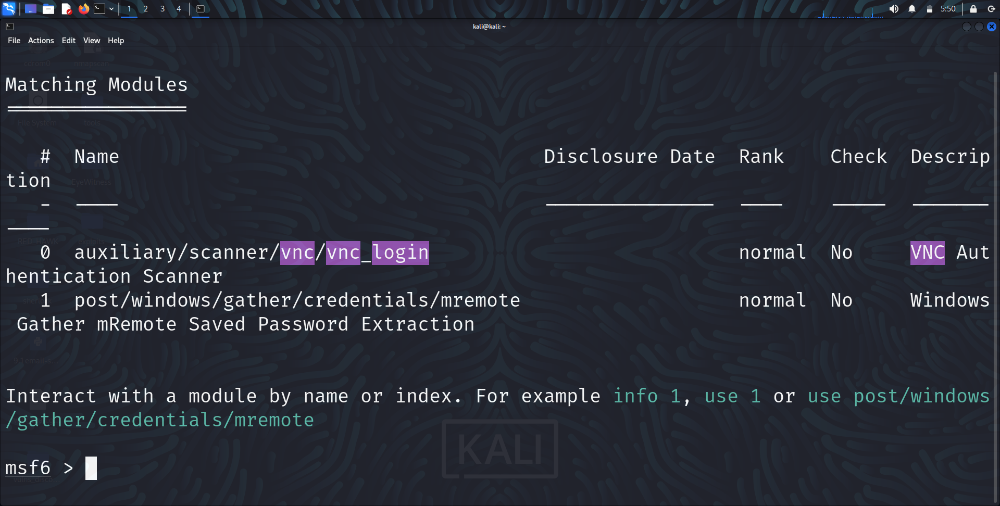

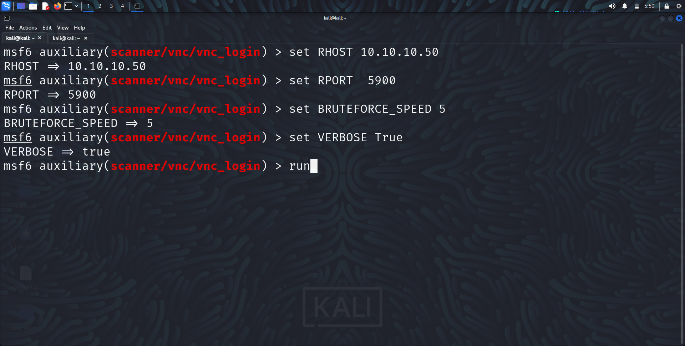

#### Affected resouces:
`10.10.10.50`

#### Recommendation
Upgrade to the latest version preferably version UltraVNC 1.5.0.0

---

###  Apache Tomcat AJP File Read/Inclusion

| *Current Rating:* | CVSS Score   |
|-------------------|--------------|
|  Critical        |        9.8  |

Allows attackers to read or include files from the server using the AJP connector, leading to information disclosure and possible RCE. Attackers send crafted AJP messages to the server. Tools like `ajpycat` can exploit this.

#### Evidence: 

The Ghostcat vulnerability (CVE-2020-193) allows attackers to read or include files from the server using the AJP connector, leading to potential information disclosure and remote code execution. The AJP Connector was enabled by default in Apache Tomcat versions 9.0.0.M1 to 9.0.0.30, 8.5.0 to 8.5.50, and 7.0.0 to 7.0.99, listening on all configured IP addresses. The vulnerability allows arbitrary file retrieval and execution as JSP if file upload is permitted.

Mitigation Recommendations:

- Restrict AJP ports from untrusted users.
- Upgrade to Apache Tomcat versions 9.0.31, 8.5.51, or 7.0.100 or later to benefit from hardened default configurations. Adjust configurations as needed after upgrading.

### Web-Based Attack Surfaces

Web-based attack surfaces encompass web application interfaces, authentication mechanisms, APIs, and server configurations. These areas can present security risks such as SQL injection or session hijacking. Key security measures include:

- Input validation
- Secure session management
- Keeping software updated

Addressing vulnerabilities in these areas helps protect against exploits and enhances overall web security.

### Using Eyewitness for Web Server Screenshots

To take screenshots of servers, including those on non-standard HTTP/HTTPS ports, use the following bash command:

eyewitness -f hosts.txt --web --resolve --ports 80,443,8080,8443

### Generating Payloads with msfvenom

To generate a base64-encoded payload that triggers a TCP bind shell on execution on host 10.10.10.55 (Apache Tomcat), use this command:

msfvenom -p java/meterpreter/bind-tcp LHOST=10.10.10.55 LPORT=4444 -f jar

For a payload that triggers a TCP bind shell on execution on host 10.10.10.30 (Python Server), use this command:

msfvenom -p python/meterpreter/bind-tcp LHOST=10.10.10.30 LPORT=4444 -e base64

These commands will help you create the necessary payloads for your penetration testing tasks.

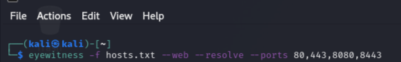

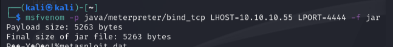

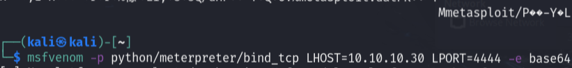

---

## CVSS v3.0 Reference Table
| Qualitative Rating | CVSS Score   |
|--------------------|--------------|
| None/Informational | N/A          |
| Low                | 0.1 – 3.9    |
| Medium             | 4.0 – 6.9    |
| High               | 7.0 – 8.9    |
| Critical           | 9.0 – 10.0   |
